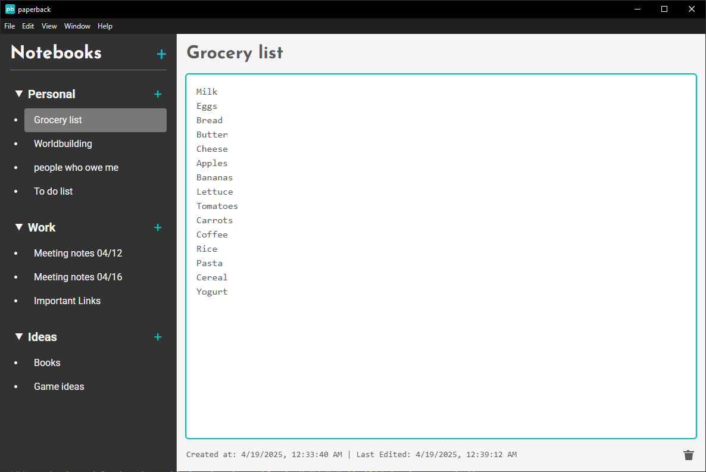
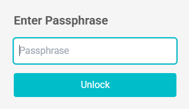
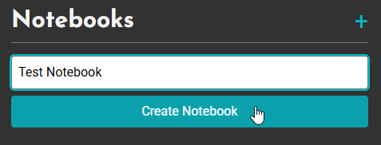

# Paperback

A simple, desktop note‑taking app with encryption. All notebooks and notes are stored locally and encrypted with a passphrase you supply on startup.
This is a project started to learn electron (and a bit more about encryption.)

## Features

- **Organization**  
  Create multiple notebooks, each containing any number of notes. Drag notes and notebooks around to your liking!

- **Automatic saving**  
  Notes are saved automatically as you type.

- **AES‑256 encryption**  
  Your data is encrypted on disk using a key derived from your passphrase via PBKDF2.

- **Portable data folder**  
  Copy your user data folder (containing the encrypted database and salt) to another computer and open with the same passphrase.

## How encryption works:

- On first launch a 16‑byte random salt is created and stored in your user‑data folder.
- Each startup, you enter your passphrase; the app runs PBKDF2 once to generate a 256‑bit key.
- Note titles and content are encrypted with AES‑256‑GCM and stored in a local SQLite database.
- Without the correct passphrase and salt, the database contents are unreadable.

## Portability:
- The encrypted SQLite file (paperback.db) and the salt live in your OS’s user‑data directory.
- Copy that entire folder to a new computer, install Paperback there, and enter the same passphrase to unlock all your notes.

## Installation:

1. Clone the repository.

2. Run `npm install`.

3. In development use `npm run start`.

4. For a production build use `npm run build` and then `npm run dist` to package an installer.

## How to Use

- Upon first using the app, you'll be prompted with a request for a passphrase
- This will be the ONLY passphrase that works! Don't forget it!

- Once entered, you'll be able to add notebooks and notes as you like! 
- Try creating a notebook!

- Just remember that you'll be prompted with entering the passphrase every time you start the app!

## Tech Stack
- Vue.js 3 & Tailwind CSS: Frontend
- Electron.js: Backend
- Better-sqlite3: Database
- Vuedraggable: For dragging/moving notes & notebooks

This work is licensed under a
[Creative Commons Attribution-NonCommercial-ShareAlike 4.0 International License][cc-by-nc-sa].

[![CC BY-NC-SA 4.0][cc-by-nc-sa-image]][cc-by-nc-sa]

[cc-by-nc-sa]: http://creativecommons.org/licenses/by-nc-sa/4.0/
[cc-by-nc-sa-image]: https://licensebuttons.net/l/by-nc-sa/4.0/88x31.png
[cc-by-nc-sa-shield]: https://img.shields.io/badge/License-CC%20BY--NC--SA%204.0-lightgrey.svg